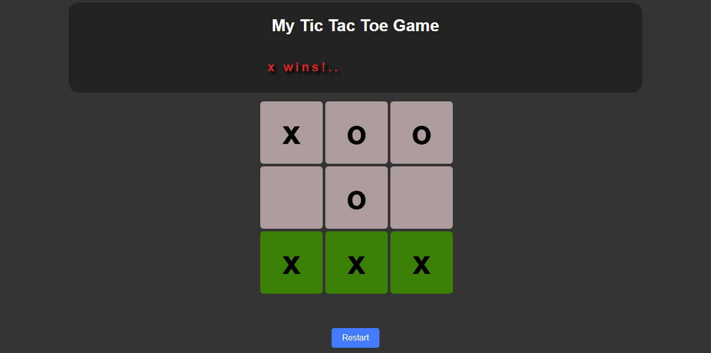

# 🏆 Tic-Tac-Toe Game

A simple **Tic-Tac-Toe** game built with **HTML, CSS, and JavaScript**. Play against a friend in this classic 3x3 grid game!  

## 🔗 Live Demo  
👉 [Play the game here](https://zingy-platypus-6acd03.netlify.app/)  

---

## 📌 Features  
✅ Two-player gameplay (X vs. O)  
✅ Automatically checks for a win or draw  
✅ Highlights winning cells  
✅ Restart button to reset the game  

---

## 📷 Screenshot  
  

---

## 🛠️ Technologies Used  
- 🏗️ HTML  
- 🎨 CSS  
- ⚡ JavaScript  

---

## 🚀 How to Play  
1️⃣ Click on an empty cell to place your mark (**X** or **O**).  
2️⃣ Players take turns until one **wins** or the game ends in a **draw**.  
3️⃣ The winner's cells **turn green**. If it's a draw, all cells **turn red**.  
4️⃣ Click the **"Restart"** button to play again.  

---

## 📂 Project Structure  
```bash
📁 TicTacToe
 ┣ 📜 index.html  # Main HTML file
 ┣ 📜 style.css   # Styling for the game
 ┗ 📜 main.js     # Game logic
